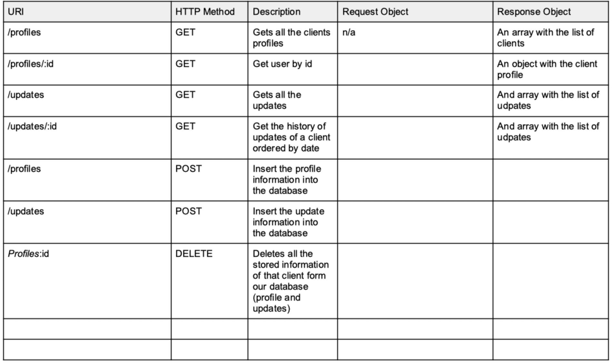

# bodyCulture_project

CodeOp 1st project.
WebApp in which clients can upload and send a couple of forms that a personal trainer will use to personalize the trainings for each client.

## SetUp

### Dependencies

- Run `npm install` in project directory. This will install server-related dependencies such as express.
- `cd client` and run `npm install`. This will install client dependencies (React).

### Database Prep

- Access the MySQL interface in your terminal by running `mysql -u root -p`
- Create a new database called bodyCultureBcn: `create database bodyCultureBcn`
- Create 3 tables
- Add a .env file to the project folder of this repository containing the MySQL authentication information for MySQL user. For example:

```javascript
DB_HOST = localhost;
DB_USER = root;
DB_NAME = bodyCultureBcn;
DB_PASS = YOURPASSWORD;
SUPER_SECRET = YOURSECRET;
```

- Run `npm run migrate` in the project folder of this repository, in a new terminal window. This will create 3 tables called 'users','profiles' and 'updates' in your database.

- Make sure you understand how all the tables are constructed. In your MySQL console, you can run `use database bodyCultureBcn`; and then `show tables`; to see the structure of the table. Run `describe users` in case you want to check the content of the users table. You can do the same with the rest of the tables.

- If you want to fill the database with a couple of examples, run `npm run seed`

### Development

- Run `npm start` in project directory to start the Express server on port 5000
- In another terminal, do `cd client` and `run npm start` to start the client in development mode with hot reloading in port 3000.

### Stack

- JavaScript, React.js, Express.js, mySQL
- Other libraries: axios, sequelize

### Database schema


### Table endpoints



_This is a student project that was created at [CodeOp](http://codeop.tech), a full stack development bootcamp in Barcelona._
